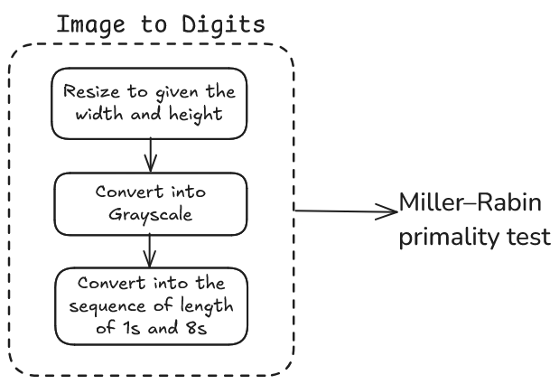

## Overview
Takes an image and finds a prime that looks like that image. Then it checks it for the primality check using Miller–Rabin primality test. 



More details are on this blog: https://www.lbatalha.com/blog/prime-motion-picture


## Usage

```bash
$ python get_prime.py [Image path] {image_width} {image_height}            
```


## Examples
1. pokeball-vectorstock.jpg 
    
    Prime
    ```
        1111111111111111111111111111111111111111111111111111111111111111111111111111111111111111111111111111111111111111111111111111111111111111888888881111111111111111111111111111188888888888888111111111111111111111111888888888888888888111111111111111111111888888888888888888881111111111111111111888888888888888888888811111111111111111888888888888888888888888111111111111111888888888888888888888888881111111111111188888888888888888888888888111111111111188888888888881188888888888881111111111118888888888811111188888888888111111111111888888888881111118888888888811111111111188888888888111111888888888881111111111118881111118888118888111111888111111111111888111111188888888111111188111111111111118881111111188881111111188811111111111111188811111111111111111188811111111111171118888111111111111111188811111111111111111118888111111111111888811111111111111111111188888111111118888811111111111111111111111188888888888888111111111111111111111111111118888888811111111111111111111111111111111111111111111111111111111
    ```

    Number Art:
     ```
        1111111111111111111111111111111111111111
        1111111111111111111111111111111111111111
        1111111111111111111111111111111111111111
        1111111111111111888888881111111111111111
        1111111111111888888888888881111111111111
        1111111111188888888888888888811111111111
        1111111111888888888888888888881111111111
        1111111118888888888888888888888111111111
        1111111188888888888888888888888811111111
        1111111888888888888888888888888881111111
        1111111888888888888888888888888881111111
        1111118888888888888118888888888888111111
        1111118888888888811111188888888888111111
        1111118888888888811111188888888888111111
        1111118888888888811111188888888888111111
        1111118881111118888118888111111888111111
        1111118881111111888888881111111881111111
        1111111888111111118888111111118881111111
        1111111188811111111111111111188811111111
        1111711188881111111111111111888111111111
        1111111111888811111111111188881111111111
        1111111111188888111111118888811111111111
        1111111111111888888888888881111111111111
        1111111111111111888888881111111111111111
        1111111111111111111111111111111111111111
    ```

2. pikachu_spotify.jpg
    
    Prime
    ```
        1111111111111111111111111111111111111111118881111111111111111111111111111111111111888888111111111111111111111888888111111118881888111111111171111118888888111111111188888888111111111111188881888111111111111188888881188888811888888881118888811111111188888888888888888888888888888881111111111188888888888888888888888888881111111111118888888888888888888888888888111111111111888888888888888888888888888811111111111188888888888888888888888888811111111111188888888881888888888888811111111111111118888888888888188888888111111111111111111188888888888888888888881111111111111111111888888888888888188888811111111111111111188888888888888888888811111111111111111188888888888888888881111111111111111111188888888888888888888111111111111111111188888888888888888888111111111111111118888888888888188888888881111111111111111888888888888888888888888881111111111111118888888888888888888888888111111111111111188888888888888888888881111111111111111111188888888111888888881111111111111111111111111111111111111111111111111111
    ```

    Number Art:
    ```
        1111111111111111111111111111111111111111
        1188811111111111111111111111111111111111
        1188888811111111111111111111188888811111
        1118881888111111111171111118888888111111
        1111888888881111111111111888818881111111
        1111118888888118888881188888888111888881
        1111111188888888888888888888888888888881
        1111111111888888888888888888888888888811
        1111111111888888888888888888888888888811
        1111111111888888888888888888888888888811
        1111111111888888888888888888888888888111
        1111111118888888888188888888888881111111
        1111111118888888888888188888888111111111
        1111111111888888888888888888888811111111
        1111111111188888888888888818888881111111
        1111111111188888888888888888888811111111
        1111111111888888888888888888811111111111
        1111111118888888888888888888811111111111
        1111111188888888888888888888111111111111
        1111188888888888881888888888811111111111
        1111188888888888888888888888888111111111
        1111118888888888888888888888888111111111
        1111111888888888888888888888811111111111
        1111111118888888811188888888111111111111
        1111111111111111111111111111111111111111
    ```
3. jupyter_icon.jpg
 
    Prime
    ```
    1111111111111111111111111111111888811111111111111111111111111111111111888888111111188111111111188888888881111188888811111188881111188888888888888888811188111111118888118888888888888888888888881111111111111188888888888888888888888888881111111111188888111111111111111111113888811111111188111111111111111111111111111188111111111111111111111111111111111111111111111111111111111111111111111181111111111111118118111811888881181118188881888811888111881881188188118818818818881888888188111188188118818811881188811181188888818811118818888811888881118811118881888811881188811111111188111118811111111111111111111111111111111111111111111111111111111111111188111111111111111111111111111188111111111888811111111111111111111118888111111111118888888888811111188888888888111111111111118888888888888888888888881111111111111111118888888888888888888111111111111111888881111118888888888111111111111111111888888811111111111111111111111111111111188888881111111111111111111111111111111111888881111111111111111111111111111111
    ```

    Number Art:
    ```
        1111111111111111111111111111111888811111
        1111111111111111111111111111118888881111
        1118811111111118888888888111118888881111
        1188881111188888888888888888811188111111
        1188881188888888888888888888888811111111
        1111118888888888888888888888888888111111
        1111188888111111111111111111113888811111
        1111881111111111111111111111111111881111
        1111111111111111111111111111111111111111
        1111111111111111111111111181111111111111
        1181181118118888811811181888818888118881
        1188188118818811881881881888188888818811
        1188188118818811881188811181188888818811
        1188188888118888811188111188818888118811
        8881111111118811111881111111111111111111
        1111111111111111111111111111111111111111
        1111881111111111111111111111111111881111
        1111188881111111111111111111111888811111
        1111118888888888811111188888888888111111
        1111111188888888888888888888888811111111
        1111111111888888888888888888811111111111
        1111888881111118888888888111111111111111
        1118888888111111111111111111111111111111
        1118888888111111111111111111111111111111
        1111888881111111111111111111111111111111
    ```


## Limitations
Due to the computations limitations, the images would need to be restricted with smaller resolutions (all examples are generated with 40x25=1000 digit prime number). But this idea is still cool in my opinion!
